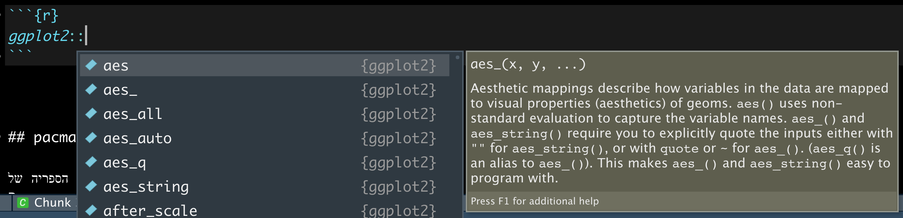

# ספריות

ספריות, או באנגילת
packages
הן קבצים שאחנו יכולים להוריד וכך להוסיף פונקציות שימושיות לסביבת ה
R
שלנו, והרחיב את היקף הדברים שאנחנו יכולים לעשות בה.

שפת 
R
היא ״שפת קוד פתוח״
והמשמעות של זה היא שהתוכנה אינה שייכת לחברה מסחרית אחת, אלא היא נוצרה ומתוחזקת על ידי קהילת המשתמשים בה.
בתור אחת משפות התכנות הפופולאריות ביותר בעולם, יש ל
R
מיליוני משתמשים אשר תורמים לפיתוח שלה. כתיבת ספריות קוד היא אחת מהדרכים הכי שכיחות של תרומה כזאת. כל משתמש יכול לכתוב ספריה שתכיל את הפונקציות שלו, ולשתף אותן ברחבי האינטרנט למשתמשים אחרים. כך שהרבה פעמים, כאשר נמצא את עצמנו מעוניינים לבצע פעולה מסובכת, נגלה שמישהו כבר פתור אותה, כתב את הפתרון בתור פונקציה בספרייה, ושיתף אותה איתנו, וכל שנותר לנו הוא להוריד את הספריה למחשב שלנו.

## איך להוריד ולטעון ספריות

להוריד ספריות זה ממש קל!

## base-r

נניח ואני רוצה להוריד את הספריה 
`ggplot2` 
שהיא ספריה מדהימה ליצרית ויזואליזציות.

כל שעלי לעשות הוא להשתמש בפונקציה 
`install.packages`
ולהזין למה את שם הספריה שאני מעוניין להוריד בתור מרכאות

```{r eval=FALSE, include=TRUE}
install.packages("ggplot2")
```

הרצת שורת הקוד הזאת תפנה לדף האינטרנט שבו מאוחסן הקוד של הספריה, ותוריד אותו למחשב האישי שלכם.

כעת, בכל פעם שארצה להשתמש בספרייה הזאת, יהיו עלי להשתמש בפקודה 
`library`
שתקבל את שם הספריה שאותה אני רוצה לטעון, אך הפעם ללא מרכאות.


```{r eval=FALSE, include=TRUE}
library(ggplot2)
```

אפשר לחשוב על ההורדה של הספריה בתור קניית מצרכים מהסופר ואחסונם במזווה שלנו, ובטעינה של הספריה, הוצאה של המצרכים מהמזווה כדי להתחיל להכין איתם מנה מדהימה, או קוד אדיר!

## מבט על כל הפונקציות שיש בכל ספריה

כדי לראות את כל הפונקציות שכל ספריה מציעה,
נרשום את שם הספריה, ונוסיף
`::`
ואז תופיע לנו רשימה של הפונקציות שהספריה מכילה




## pacman

דרך מעט נוחה יותר בעיני לעשות זאת היא להשתמש במנהל ספריות. הספריה של 
R
`pacman`
תאפשר לנו להוריד ולטעון ספריות בפקודה אחת, ובאופן יותר קריא.

נתחיל קודם כל בלהוריד את הספריה

```{r eval=FALSE, include=TRUE}
install.packages("pacman")
```

כעת, נעשה שימוש בפקודה
`p_load`
כדי להוריד ולטעון את הספריות שאנחנו מעוניינים בהם. אם ספריה הורדה בעבר למחשב שלנו, 
pacman 
רק תטען אותה, 
ואם היא אינה הורדה בעבר למחשב שלנו
היא גם תורד וגם תטען בפקודה אחת

```{r eval=FALSE, include=TRUE}
pacman::p_load(
  ggplot2,
  data.table,
  DT,
  lubridate
)
```


